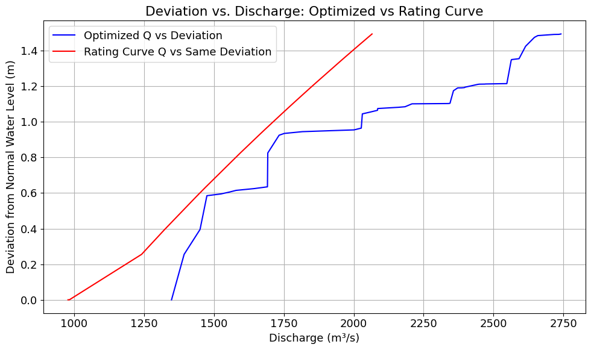

# Optimization of Lake Victoria Water Releases to Minimize Level Rise-Induced Flooding Using NSGA II

<p align="justify">This project aims at optimizing water discharge at the Nalubale and Kira hydropower stations using historical data provided by UEGCL. Three regression models were developed to predict daily discharge from water levels: a feed forward neural network (FFNN), a polynomial regression model, and a random forest regressor. Based on k-fold cross-validation, the random forest regressor demonstrated the best generalization performance and was selected for subsequent analysis.</p>

<p align="justify">After establishing a reliable water level–discharge relationship, multi-objective optimization was performed to maximize discharge while keeping water levels within the conservation operational range. This was implemented using the NSGA-II algorithm from the Pymoo library, resulting in Pareto-optimal discharge strategies.</p>



---

## 📁 Repository Structure

```text
├── LICENSE                     # MIT License file
├── README.md                   # This README file
├── requirements.txt            # List of Python dependencies
├── setup.bat                   # Setup script for Windows users
├── sheets/                     # Raw data from UEDCL
├── resources/                  # Generated resources
│   ├── datasets/               # Train/test data used in model development
│   │   ├── train/
│   │   └── test/
│   ├── images/                 # visual outputs
│   ├── models/                 # Serialized model weights
│   │   ├── neural_network/
│   │   ├── polynomial/
│   │   └── random_forest/
│   └── results/                # Optimization outputs in csv
├── src/                        # Source code files
│   ├── constants.py
│   ├── dataset_handler.py
│   ├── kfold_ml.py
│   ├── models.py
│   ├── neural_network.py
│   ├── optimize.py
│   ├── poly_model.py
│   └── random_forest.py
├── Time series codes and Gumbel/    # Time series plots and return period plots
```

---

### How to Download and Set Up the Project

1. **Download the Project**

   - On this GitHub page, click the green **Code** button and select **Download ZIP**.
   - Once downloaded, extract (unzip) the contents to a location of your choice.

2. **Open Command Prompt and Navigate to the Folder**

   - Press `Win + R`, type `cmd`, and hit Enter.
   - In the command prompt, select the drive where the extracted folder is located (for example, if it's on drive D:), type `D:` and press enter.

      ```cmd
      D:
      ```

   - Use the `cd` command to go into the extracted folder. For example:
  
     ```cmd
     cd D:\Path\To\ExtractedFolder
     ```

3. **Run the Setup Script**

   - In the command prompt, type:

     ```cmd
     setup.bat
     ```

   - Alternatively, right-click `setup.bat` and select **Run as administrator**.

> ⚠️ **Note:** The setup requires **Python 3.10.11** to be installed. If a different version is detected or Python is not found, the script will exit and notify you.

---

## 👥 Contributors

- **Bigabwamukama Lawrence** - Research and Development
- **Kato Esau** - Research and Development

---

## 📜 License

This project is licensed under the MIT License. See the [LICENSE](LICENSE) file for details.
